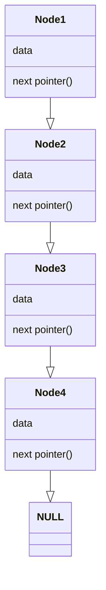

## Single Linked List
- Linked list는 <strong>컨테이너</strong>라고도 한다.
- 여러 구조체 인스턴스를 체인처럼 줄줄이 포인터로 연결한 자료구조이다.
	- 이때, 연결된 포인터의 개수는 한 개이다.
- 

```mermaid
classDiagram
Node1--|>Node2
Node2--|>Node3
Node3--|>Node4
Node4--|>NULL
class Node1{
	data
	next pointer()
}
class Node2{
	data
	next pointer()
}
class Node3{
	data
	next pointer()
}
class Node4{
	data
	next pointer()
}
```